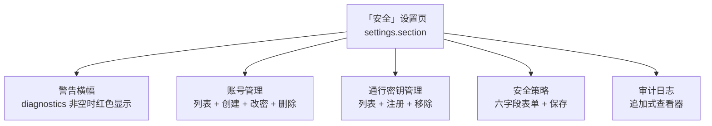

# M4 设置界面与部署文档产品规格

## Problem Statement

dsh-web-security 插件在 M1–M3 已交付全部 host 侧能力：14 个 typert `@Remote` 端点、TLS 安全入口服务器（认证门 + HTTP/WS 反向代理）、WebAuthn 通行密钥服务。但浏览器侧 `src/client/index.ts` 的 `apply` 仍是空壳——部署者与登录用户没有任何 UI 手段管理账号、调整安全策略、查看审计日志或管理通行密钥；部署方也缺少一份可照做的部署文档。插件「配置在宿主设置界面完成」的核心承诺（README 首段）至今未兑现。

同时存在四个已知缺口（均经仓库工具核验）：

1. passkey 只有注册没有移除——设备丢失场景无解（grill-me Q4 确认增补）；
2. `status.diagnostics` 是硬编码空数组（`host-endpoints.ts:199`）——3080 非 loopback 绑定时用户无感知（蓝图风险 2 + grill-me Q5 确认真实探测）；
3. `build.mjs` 的 `PLATFORM_MODULES` 含不存在的 `@deepseek-ai/dsh-client-schema-form`（M0 错误占位，宿主 rc.2 `packages/client/` 无此包）；
4. `accountRemove` 端点删除账号后不撤销该账号活跃会话（`host-endpoints.ts:253-261` 现状只删账号+审计）——已登录的被删用户持有效会话继续操作。

## Solution

交付三块：client 设置界面、host 侧最小增量、部署文档，并以独立 profile 实机闭环验证。

### ① client 设置界面（核心交付）

在宿主设置面板注册独立「安全」页（`settings.section` list 槽位，与宿主 General/Models/Plugins 页同级），内含五个区块：

- **警告横幅**：`status().diagnostics` 非空时顶部红色横幅逐条渲染（含 loopback 警告文案）。
- **账号管理**：`accountsList` 列表（用户名/hasPasskey/createdAt）；「创建账号」表单（用户名+密码，host 侧校验强度与字符集）；改密（当前+新密码）；删除（`RiskConfirmation` 二次确认——删除管理员可能锁死部署）。
- **通行密钥管理**：每账号 passkey 凭证列表 + 「注册通行密钥」入口（`passkeyRegisterBegin/Complete`，浏览器 WebAuthn API）+ 移除按钮（`passkeyRemove`，M4 新增）。
- **安全策略**：六字段（passwordLogin/passkeyLogin/sessionTtlMinutes/maxLoginAttempts/rateLimitWindowMinutes/auditEnabled）受控表单；「保存」按钮只提交脏字段（diff 后的 Partial）；passwordLogin 与 passkeyLogin 同关时被 host 自锁死防护拒绝（审计 X2），UI 呈现该错误；降级方向变更（关审计、放宽限速、延会话）时 `RiskConfirmation` 二次确认。
- **审计日志**：`auditRead(offset=0, limit=50)` 首屏，「加载更多」按 offset 续拉，`hasMore=false` 隐藏按钮；每条渲染 kind 徽章 + 时间 + actor/ip + detail，全部文本经转义渲染。

**技术形态**（grill-me 锁定）：`ctx.slots.inject('settings.section', () => ctx.slots.register({...}))` 等待槽位声明；remote 消费在 `$mount` 后 child fiber（防死锁——指南 7.2）；手写受控表单 + `@deepseek-ai/dsh-client-ui-primitives` 原语（Button/Input/Modal/RiskConfirmation/Pill）；zh/en 双词典（`ctx.locale.register(NS, { zh, en })` + `label: () => t('page')`）；样式只用 `--dsw-alias-*` CSS 变量。

### ② host 侧最小增量

1. **`passkeyRemove` 端点**（新增，第 15 端点）：请求 `{ username, credentialId }` → `RemoteEnvelope<void>`；实现经 `account-store.removePasskey`（新增方法）+ `passkey-removed` 审计事件；自锁死防护参照 `settingsWrite` 既有范式（`host-endpoints.ts:268-275`）：移除将导致「该账号无 passkey 且 passwordLogin=false（全局）」时返回 `lockout-prevented` 错误拒绝。
2. **`status.diagnostics` 真实填充**：`SecurityService` 构造时读 `ctx.get('webServer')?.host`（服务已注入），非 `127.0.0.1` 时写入警告字符串（如 `host-webserver 绑定 {host}：LAN 设备可绕过认证门直连 3080 API`）；经 `SecurityDeps.config.diagnostics` 通道注入（`config` 面扩一个 readonly string[] 字段）；`status()` 直接返回该数组。
3. **`build.mjs` 修正**：从 `PLATFORM_MODULES` 移除不存在的 `@deepseek-ai/dsh-client-schema-form`。
4. **账号删除-会话联动**：`session-store` 新增 `revokeAllForUser(username)`；`accountRemove` 端点实现在删除成功后调用（撤销产生 `session-expired` 审计事件，actor=被删用户名，detail 注明账号删除）。

### ③ 部署文档 `docs/deployment.md`

四要素（验收 A6）：自签证书路径（内嵌 openssl 一行命令 + 浏览器手动信任步骤）与受信证书路径（Let's Encrypt 指引）；**3080 必须 loopback 绑定**的红色强调（解释宿主 resolveLanTrust 行为）；首管理员 loopback 初始化流程（审计 S1 方案 A：无账号时无法登录，设置页不可达，须本机 CLI/curl 初始化）；`cordis.patch.yml` 全量配置样例（含 rpID、entry/session/rateLimit 全字段）。

## User Stories

1. 作为部署者，我打开宿主设置面板，看到「安全」页出现在 General/Models/Plugins 旁，点开能看到入口状态、账号、策略与审计概览，以便确认插件已正确工作。
2. 作为部署者，我在**无任何账号**的全新部署上打开 3443 入口，看到登录页但无法登录（无凭据）；按部署文档在本机 loopback 完成首账号初始化后，方能登录进入设置界面——文档必须把这条路径写清（设置页本身不做「初始化向导」）。
2a. 作为部署者，误把 3080 绑到 `0.0.0.0` 时，打开「安全」页立即看到红色横幅「LAN 设备可绕过认证门直连 3080」，以便我修正绑定。
2b. 作为英文界面用户，我看到「Security」页与其内全部文案为英文，无中英混排割裂。
3. 作为已登录用户，我在「安全」页创建新账号（用户名+密码），密码强度不足或用户名非法时看到具体原因，成功后列表即时刷新（设置页在 3080 web-ui 内，调用经代理归一化为 loopback 流量，accountCreate 天然可用）。
4. 作为已登录用户，我修改某账号密码，旧密码错误时得到明确反馈，成功后看到「已更新」状态与密码变更审计事件。
5. 作为已登录用户，我删除账号前经 RiskConfirmation 确认，确认后账号从列表消失、该账号活跃会话被撤销、产生 `account-removed` 审计事件。
6. 作为已登录用户，我点「注册通行密钥」触发浏览器 WebAuthn 流程，完成或取消后 UI 反映对应状态；注册成功后凭证出现在该账号名下。
7. 作为已登录用户，我移除某账号的通行密钥，确认后凭证消失并产生 `passkey-removed` 审计事件。
8. 作为已登录用户，我移除某账号最后一个通行密钥且密码登录已关闭时，操作被 host 拒绝（`lockout-prevented`）并看到自锁死防护的解释文案。
9. 作为已登录用户，我调整安全策略六个字段后点「保存」，只有改动字段被提交；未改动时保存按钮置灰。
10. 作为已登录用户，我试图关闭审计或放宽限速时，弹出 RiskConfirmation 二次确认，我确认后变更生效并产生 `settings-changed` 审计事件。
11. 作为已登录用户，我在审计日志首屏看到最近 50 条事件（最新在前），点「加载更多」追加下一页，直到 `hasMore=false` 按钮消失。
12. 作为已登录用户，某条审计事件的 actor 或 detail 含 `` 时，我看到的是字面文本而非执行或注入（L3 转义）。
13. 作为已登录用户，任一 RPC 失败（网络断/会话过期）时，对应区块显示错误态与重试入口，而非白屏或静默失败。
14. 作为已登录用户，浏览器不支持 WebAuthn（如 http 环境）时，passkey 注册入口禁用并说明原因，不抛未捕获异常。
15. 作为领取任务的开发者，我按规格单条 User Story 领取开发时，每条故事有明确的测试期望与既有先例可循（见 Testing Decisions）。

## Implementation Decisions

- **挂载**：`settings.section`（list，id=`security`，order 实现期对照宿主四页 order 值选取不冲突位次）；`slots.inject` 包装等待声明，避免对宿主 apply 顺序的依赖。
- **死锁规避**：`remote.security` 的消费在 `$mount` 后的 child fiber 内进行（dsh-git-ui `client-adapter.ts` 范式）；主 fiber `inject` 声明保持 `['slots', 'remote', 'locale']` 不变，remote 具体服务在 child fiber inject。
- **主页面结构**：单页五区块（横幅/账号/passkey/策略/审计）纵向排列；区块是否用 `DisclosureRow` 折叠是实现自由度（非契约）。
- **表单**：手写受控组件（useState 管理草稿值）；新增/改密表单用 `Input`（type=password）；删除与降级确认用 `RiskConfirmation`；不引入 schema-form（不存在）。
- **保存模型**：本地草稿 vs `settingsRead` 快照 diff → 脏字段 Partial → `settingsWrite`；保存中禁用按钮；成功后以服务端返回值为准刷新。
- **审计查看器**：状态机 idle/loading/ready/error；「加载更多」推进 offset；列表项文本全部经 `textContent` 赋值或等价转义。
- **passkeyRemove**：host 端点 + client zod 镜像 + UI 按钮三件套；自锁死判定在 host 端强制（UI 可被绕过，UI 只呈现错误）。
- **diagnostics**：构造时一次性探测（绑定值运行期不变），写入 `deps.config.diagnostics`；`status()` 直接返回。
- **构建**：`build.mjs` 移除 schema-form 幽灵项；client 半 esbuild 配置不变（react/jsx automatic 已就绪）。
- **账号删除-会话联动**：`session-store.revokeAllForUser(username)` 新增；`accountRemove` 端点删除成功后调用。
- **locale**：NS = `settings.security`；zh 词典为主，en 为对照；`label: () => t('page')` thunk 形式（宿主 locale 变更时重注册）。
- **类型面**：`src/adapters/dsh/types/` 补 client 侧 `.d.ts`（runtime/ClientContext、locale、ui-slots、ui-settings section owner props、ui-primitives 组件 props）——形状以 `.wiki` rc.2 快照为准手写，运行时由宿主解析。
- **首账号路径**：设置页不做初始化向导；无账号场景由部署文档覆盖（loopback CLI/curl 初始化）。已登录后创建账号无 loopback 障碍（代理归一化）。
- **实测环境**：独立 profile `web-sec-test`（`DSH_HOME=$PWD/.test-dsh-home`，端口 3081）；复用 `scripts/reinstall.sh --test` 闭环。

## Testing Decisions

**唯一外部 seam**：真实构建产物 `lib/client.js` 在 jsdom 中的设置页挂载与交互（测试文件拟为 `tests/client/settings-page.spec.ts`，文件首行 `// @vitest-environment jsdom` pragma——**已核实**：vitest.config.ts 未设全局 environment，per-file pragma 生效；jsdom 已在 devDependencies）。

- **seam 形态**：vitest + jsdom 环境，加载真实构建产物 `lib/client.js`（ModuleLoader 闭包格式），提供 stub `window.__ModuleLoader__` + stub 平台模块（react/ui-primitives/ui-slots/locale/remote），断言用户可观察行为（页面注册、表单提交、列表刷新、错误反馈）。
- **为什么是它**：M4 的用户可观察行为全部在浏览器侧；既有测试体系（vitest 112 例 + smoke-host.mjs）不能覆盖 UI 挂载与交互；浏览器实机验收（A8）是发布验收而非开发内循环。
- **独立期望值**：每条 User Story 至少一个显式断言（见下方映射表）。
- **既有先例**：`tests/client/remote.spec.ts`（zod 镜像同步守护，20 例）；`tests/entry-server.spec.ts`（HTTP 层行为）；`tests/smoke-host.mjs`（真实装配冒烟，13 断言）。

**User Story → 测试期望映射**：

| 故事 | jsdom seam 断言 | host 侧新增单测 |
|---|---|---|
| 1 | 挂载后 slot register 调用（名=`settings.section`、id=`security`）成功；页骨架五个区块渲染 | — |
| 2 | 无账号场景不产生 UI 特判（登录页外无设置页入口）；部署文档存在首账号章节（文档断言） | — |
| 2a | status stub diagnostics 非空 → 横幅渲染警告文本 | diagnostics 填充：webServer.host=0.0.0.0 → 警告出现；127.0.0.1 → 空 |
| 2b | locale stub 切 en → 页面文本变英文 | — |
| 3 | 创建表单提交 → `accountCreate` 调用参数正确；错误码→文案映射 | —（account-store 既有 18 例） |
| 4 | 改密表单提交 → 调用参数；失败反馈 | —（端点既有） |
| 5 | 删除 → RiskConfirmation 出现 → 确认 → `accountRemove` 调用 + 列表移除 | accountRemove 端点删除成功后调 `revokeAllForUser` 单测 |
| 6 | passkey 注册按钮 → `passkeyRegisterBegin` 调用；stub WebAuthn 成功 → `passkeyRegisterComplete` 调用 | —（webauthn 既有 10 例） |
| 7 | passkey 移除 → 确认 → `passkeyRemove` 调用 | removePasskey store 单测；passkeyRemove 端点单测 |
| 8 | stub 返回 `lockout-prevented` → UI 呈现解释文案 | passkeyRemove 自锁死拒绝单测（最后凭证+密码关） |
| 9 | 改一字段 → 保存提交仅含该字段；未改动 → 按钮禁用 | —（settingsWrite 既有） |
| 10 | 降级变更 → RiskConfirmation → 确认 → `settingsWrite` 调用含脏字段 | —（审计事件既有断言） |
| 11 | 首屏 50 条 + 加载更多推进 offset；hasMore=false 按钮隐藏 | —（audit-log 既有 7 例） |
| 12 | actor=`<script>` 事件渲染后 DOM 无 script 注入（textContent 断言） | — |
| 13 | stub remote reject → 区块错误态 + 重试按钮 → 恢复 | — |
| 14 | jsdom 无 WebAuthn → passkey 入口 disabled + 原因文案 | — |
| 15 | 开发者按本表逐条领取（TDD Red→Green） | — |

**host 侧新增单测汇总**（vitest 既有体系，非 seam）：`removePasskey`（account-store）、`passkeyRemove` 端点（含自锁死拒绝）、`revokeAllForUser`（session-store）、`status.diagnostics` 填充（core/index 装配层）、accountRemove→撤会话联动（endpoints）。client zod 镜像新增 `passkeyRemove` descriptor 条目（`tests/client/remote.spec.ts` 同步守护扩展）。

**实机验收**（A8，发布验收，非开发内循环）：独立 profile reinstall 闭环 + 浏览器四流程（登录→账号→策略→审计→passkey）走查记录。**不把未执行的实机验收写成已通过**；`npm run smoke` 扩展 diagnostics 断言（默认配置 loopback → 空）。

## Out of Scope

- 审计 kind 筛选/搜索/页码跳转（Q7-A：追加式即可）
- 每字段即时保存（Q8-A：显式保存+脏字段）
- schema 驱动表单框架（Q3-A：手写+原语）
- 设置页「首账号初始化向导」（审计 S1 方案 A 保持 loopback-only；文档覆盖）
- 微信扫码等第三方登录
- 收窄本机信任边界（3080 管理端点对本机开放是既定威胁模型——蓝图风险 3）
- 修改登录页（M2/M3 已交付，纯中文维持）
- `.agent/` 下另一项目（dsh-git-ui）参考文档的处理
- 审计日志导出/清理/归档
- 多管理员角色/权限分级（当前为平权账号模型）
- 会话列表查看/按需强制下线 UI（只做删除联动撤销）
- `dsh` CLI 或 `reinstall.sh` 脚本功能扩展
- dev → main 合并与 npm 发布流程（M4 完成后的独立动作）

## Further Notes

- **参考实现清单**（宿主 rc.2 快照 `.wiki/deepseek-harness-dsh-v0.1.1-rc.2/` 内）：`packages/client/ui-settings-models/src/client/index.ts`（settings.section 注册全范式：type-only import + slots.inject + locale NS + label thunk + inject 面）；`packages/client/ui-settings-plugin-inventory/src/client/index.ts`（tab 形态最小例）；`packages/client/ui-settings/src/client/contract/slots.ts`（settings 槽位 owner props 契约：`SettingsSectionOwnerProps = { close }`）；`packages/client/ui-primitives/src/index.ts`（原语清单：Button/Input/Menu/Modal/Pill/RiskConfirmation/DisclosureRow/Toast/Tooltip）。
- **已知风险**（M4 分析报告 B1–B6）：死锁规避范式、槽位声明时序（slots.inject 缓解）、本地类型面 vs 运行时漂移（以快照为准 + 实机早探测）、实机环境冲突（独立 profile 缓解）、passkey 需 secure context（jsdom stub + 实机自签证书）、宿主 rc 期 API 演进。
- **关键设计定调**：自锁死防护在 host 端强制（UI 只呈现）；首账号初始化走文档不走 UI；accountRemove 撤会话是 M4 新增的安全联动。
- **本文档由 grill-me 会话（Q1–Q9 九项决策全部用户确认）综合生成**；环境事实经仓库工具核验：宿主快照包清单（schema-form 不存在）、端点清单（passkeyRemove 缺失）、accountRemove 现状（不撤会话）、vitest jsdom pragma 可用性、settings 槽位契约与原语清单。
- **TDD 说明**：实现阶段按 tdd skill 执行，同一测试真实 Red 后最小实现转 Green。
