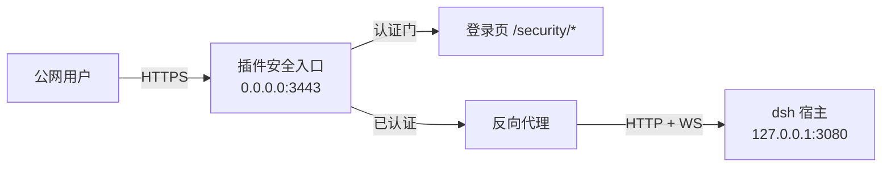

# dsh-web-security

为 [DeepSeek Harness](https://github.com/deepseek-ai/deepseek-harness)（dsh）web-ui
提供**外部安全访问入口**的插件：高安全性登录界面（账号密码 + 通行密钥），
TLS 安全入口 + 会话认证 + 反向代理到宿主 loopback 端口，配置可在宿主设置界面完成。

> 状态：**M0–M4 全部完成（含实机验证）**。设计蓝图见
> `docs/web-security-blueprint.md`，M1 实施规划见 `docs/m1-implementation-plan.md`，
> 安全审计报告见 `docs/security-audit-m1.md`，部署指南见 `docs/deployment.md`。

## 解决的问题

dsh web 默认只监听 `127.0.0.1:3080` 且无认证层。公网部署时若直接暴露，
任何人都能操作 agent、读取会话。本插件在不修改宿主的前提下提供：

- 高安全性登录界面（密码 + 通行密钥 WebAuthn）；
- TLS 入口 + 会话 Cookie（HttpOnly/Secure/SameSite=Strict）+ 登录限速 + 审计日志；
- 反向代理：认证通过后将请求**归一化为本机流量**转发到 `127.0.0.1:3080`
  （Host/Origin 改写为 loopback 形态——宿主对特权 RPC 方法的 loopback 钉死
  因此照常可用，且部署无需配置 `trustedHosts`）；
- 设置界面集中管理安全策略（设置面板「安全」页：账号/通行密钥/策略/审计四区块）。

## 架构



未认证请求只见登录页；`/api` 与 WebSocket 全部处于认证门之后（curl 直连亦不可得）。

> `./client` 导出是浏览器注入专用入口（ModuleLoader 闭包格式），非 Node 消费面。

## 开发

```bash
# 依赖安装：peer 链（@deepseek-ai/*）由宿主 dsh 安装统一提供，
# 此处仅装 devDependencies（typescript/esbuild/vitest 等）：
npm install --legacy-peer-deps
# 若默认 npm 缓存目录不可写（root 属主或沙箱环境），将缓存指到工作区内：
npm install --legacy-peer-deps --cache .npm-cache

npm run typecheck  # strict 类型检查（含 noUnusedLocals/noUncheckedIndexedAccess）
npm run build      # host 半（tsc + esbuild，永不 minify）+ client 半（ModuleLoader 闭包）
npm run test       # vitest（tests/ 目录；vitest.config.ts 已排除 .wiki 宿主快照）
npm run smoke      # 构建 + 真实装配冒烟（status/账号创建/登录闭环/入口 302/passkey 路由）
```

本地安装验证（构建 → 移除旧版 → 安装 → 重启 `dsh --profile web` → 浏览器强刷）：

```bash
./scripts/reinstall.sh --test
```

## 里程碑

| 阶段 | 内容 | 状态 |
|---|---|---|
| M0 | 设计蓝图 + 可构建骨架 | ✅ |
| M1 | host 核心：账号/会话/限速/审计/端点真实化 + client zod 镜像 | ✅ 含审计修复 |
| M2 | 安全入口：TLS + 认证门 + HTTP/WS 反向代理 + 登录页 | ✅ 含审计修复 |
| M3 | 通行密钥（WebAuthn）服务 + 入口路由 + 内联登录页 passkey JS | ✅ 含审计修复 |
| M4 | 设置界面（账号/策略/审计/passkey 四区块）+ 部署文档 + 实机验证 | ✅ 16 端点 + wire 契约修复 |

> M1–M3 各自经过攻击者视角安全审计并修复（严重发现含：首次初始化悖论、
> IP 限速分层、用户名枚举时序、challenge 一致性等）；另有全项目三轮
> 安全复审（路径规范化统一、自锁死防护、set-cookie 数组、资源边界）
> 已合入 dev 分支。M4 实机验证（独立 profile 真实宿主闭环）发现并修复
> `RemoteEnvelope<void>` 的 wire 契约缺陷（ok 分支显式 `value: undefined`
> 被宿主 gateway JSON 边界校验拒绝）。