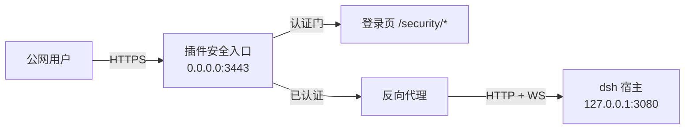

# dsh-web-security

为 [DeepSeek Harness](https://github.com/deepseek-ai/deepseek-harness)（dsh）web-ui
提供**外部安全访问入口**的插件：高安全性登录界面（账号密码 + 通行密钥），
TLS 安全入口 + 会话认证 + 反向代理到宿主 loopback 端口，配置可在宿主设置界面完成。

> 状态：**开发中（M0 骨架阶段）**。设计蓝图见 `docs/web-security-blueprint.md`。

## 解决的问题

dsh web 默认只监听 `127.0.0.1:3080` 且无认证层。公网部署时若直接暴露，
任何人都能操作 agent、读取会话。本插件在不修改宿主的前提下提供：

- 高安全性登录界面（密码 + 通行密钥 WebAuthn）；
- TLS 入口 + 会话 Cookie（HttpOnly/Secure/SameSite=Strict）+ 登录限速 + 审计日志；
- 反向代理：认证通过后透明转发 HTTP 与 WebSocket 到 `127.0.0.1:3080`；
- 设置界面集中管理安全策略。

## 架构



未认证请求只见登录页；`/api` 与 WebSocket 全部处于认证门之后（curl 直连亦不可得）。

## 开发

```bash
# 依赖安装：peer 链（@deepseek-ai/*）由宿主 dsh 安装统一提供，
# 此处仅装 devDependencies（typescript/esbuild/vitest 等）：
npm install --legacy-peer-deps
# 若默认 npm 缓存目录不可写（root 属主或沙箱环境），将缓存指到工作区内：
npm install --legacy-peer-deps --cache .npm-cache

npm run typecheck  # strict 类型检查（含 noUnusedLocals/noUncheckedIndexedAccess）
npm run build      # host 半（tsc + esbuild，永不 minify）+ client 半（ModuleLoader 闭包）
npm run test       # vitest（tests/ 目录；vitest.config.ts 已排除 .wiki 宿主快照）
```

本地安装验证（构建 → 移除旧版 → 安装 → 重启 `dsh --profile web` → 浏览器强刷）：

```bash
./scripts/reinstall.sh --test
```

## 里程碑

| 阶段 | 内容 | 状态 |
|---|---|---|
| M0 | 设计蓝图 + 可构建骨架 | ✅ |
| M1 | host 核心：账号/会话/限速/审计/端点 | 规划中 |
| M2 | 安全入口：TLS + 认证门 + HTTP/WS 反向代理 | 规划中 |
| M3 | 通行密钥 + 登录页 bundle | 规划中 |
| M4 | 设置界面 + 部署文档 + 实机验证 | 规划中 |