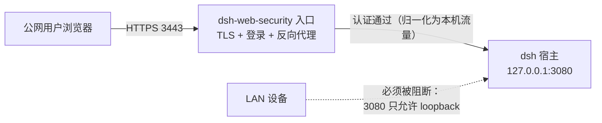

# dsh-web-security 部署指南

> 适用版本：v0.1.x（M4 起）。本指南覆盖从零部署到安全入口可用的完整路径。
> 设计背景见 `web-security-blueprint.md`；安全审计结论见 `security-audit-m1.md`。

---

## 一、部署拓扑回顾



两条硬性规则是本指南的核心：

1. **3080 必须保持 loopback 绑定**（`--host 127.0.0.1` 或不指定）。
2. **首个管理员账号必须在本机 loopback 创建**（公网永不暴露初始化入口）。

---

## 二、安装插件

```bash
# 方式 A：tgz 安装（推荐，版本可控）
dsh plugin --profile web add file:/absolute/path/to/dsh-web-security-0.1.0.tgz

# 方式 B：npm 安装
dsh plugin --profile web add dsh-web-security

# 重启宿主（必须——bundle 变更不经热重载）
dsh --profile web
```

验证安装：

```bash
cat ~/.dsh/profiles/web/package.json   # dsh.profile.bundles 应含 dsh-web-security
ls ~/.dsh/profiles/web/node_modules/dsh-web-security/lib/client.js
```

---

## 三、配置（cordis.patch.yml）

在 profile 的 patch 层（`~/.dsh/profiles/web/cordis.patch.yml`，`$DSH_HOME` 隔离时相应变化）按需覆盖（**实测格式**：顶层数组，`- id:` 定向覆盖 bundle 默认 config）：

```yaml
- id: web-security          # 实例 id（bundle 内注册行的 id）
  config:
    enabled: true
    rpID: sec.example.com   # 通行密钥绑定的域名根（不用 passkey 可留空）
    entry:
      host: 0.0.0.0         # 入口监听（公网可达面）
      port: 3443
      tls:
        certPath: null     # null = 自签（见下节）；或指向证书文件
        keyPath: null
      tlsMode: https       # 有证书 → https；开发环境可 http
    upstream:
      host: 127.0.0.1      # dsh 宿主（保持 loopback！）
      port: 3080           # 宿主端口（自定义 --port 时同步改）
    session:
      ttlMinutes: 480      # 会话时长（5–10080）
    rateLimit:
      maxAttempts: 5       # 失败锁定阈值（3–10）
      windowMinutes: 15    # 失败窗口（1–1440）
```

字段完整定义见 `normalizeConfig`（`src/host/core.ts`）；非法配置**大声失败**（启动即报错，绝不静默降级）。

---

## 四、TLS 证书

### 路径 A：自签证书（测试 / 内部环境）

```bash
# 一行生成自签证书（10 年，含 SAN——现代浏览器要求）
openssl req -x509 -newkey ec -pkeyopt ec_paramgen_curve:prime256v1 \
  -keyout key.pem -out cert.pem -days 3650 -nodes \
  -subj "/CN=sec.example.com" \
  -addext "subjectAltName=DNS:sec.example.com"
```

```yaml
entry:
  tls:
    certPath: /etc/dsh-web-security/cert.pem
    keyPath: /etc/dsh-web-security/key.pem
```

浏览器访问 `https://<host>:3443` 时会告警——手动信任：
Chrome：`chrome://flags/#allow-insecure-localhost` 不适用（非 localhost）；直接点击「高级 → 继续前往」，或把 cert.pem 导入系统/浏览器信任链并信任该 CA。

> **passkey 注意**：WebAuthn 要求 secure context。自签证书被浏览器显式信任后即满足；仅点「继续前往」跳过告警在部分浏览器上 WebAuthn 仍可用，但不保证。

### 路径 B：受信证书（生产推荐）

用 Let's Encrypt 等为入口域名签发正规证书（`certbot certonly --standalone -d sec.example.com`），把 `fullchain.pem`/`privkey.pem` 路径填入 `certPath`/`keyPath`。入口需公网可达 80/443（HTTP-01 挑战）或使用 DNS-01。

---

## 五、首管理员初始化（loopback-only）

无任何账号时，登录页可用但无人能登录——**这是设计**（防 TOCTOU 抢先初始化，审计 S1 方案 A）。在部署机本机执行（typert RPC wire 格式——`POST /api/<namespace>/<method>`，body 为 client-request 信封）：

```bash
curl -X POST http://127.0.0.1:3080/api/security/accountCreate \
  -H 'Content-Type: application/json' \
  -d '{
    "type": "client-request",
    "rpcId": "init-admin",
    "method": "security/accountCreate",
    "payload": { "args": { "request": { "username": "admin", "password": "至少12字符含数字与符号!" } } }
  }'
```

成功返回 `{"type":"server-response","rpcId":"init-admin","result":{"ok":true,"value":{"ok":true}}}`。

密码策略：最小 12 字符 + 至少 1 数字 + 1 符号；用户名 `[a-zA-Z0-9_-]{1,64}`。

之后的账号管理（创建/改密/删除/passkey）在**登录后的设置界面 → 安全页**完成（M4）。

---

## 六、3080 必须 loopback（重要）

dsh 宿主在 web 绑定 `0.0.0.0` 时会把本机 LAN IPv4 **自动并入 trustedHosts**（`resolveLanTrust`）——LAN 内设备可**绕过本插件认证门直连 3080 API**。本插件无法回收该行为，只能：

- 设置页「安全」页顶部在探测到非 loopback 绑定时显示红色警告横幅；
- 本文档明确要求：**启用安全入口的部署，宿主必须以 loopback 启动**（`dsh --profile web` 默认即 `127.0.0.1`，不要传 `--host 0.0.0.0`）。

公网访问一律走 `https://<host>:3443`（插件入口）。

---

## 七、登录与会话

- 密码登录：登录页输入用户名密码；连续失败触发账号维度指数退避锁定（1 min 起翻倍，上限 1 h）+ IP 维度限速。
- 通行密钥：需配置 `rpID` 且入口为 HTTPS；登录页「使用通行密钥登录」。注册入口在设置页「安全 → 通行密钥」。
- 会话：HttpOnly + Secure + SameSite=Strict Cookie，滑动续期；**插件/宿主重启即全员下线**（安全默认）。
- 登出：`/security/api/logout`。

## 八、数据与卸载

| 数据 | 位置 |
|---|---|
| 账号（scrypt 哈希） | `~/.dsh/plugin-data/dsh-web-security/accounts.json`（0600） |
| 用户设置 | `~/.dsh/plugin-data/dsh-web-security/settings.json` |
| 审计日志 | `~/.dsh/plugin-data/dsh-web-security/audit.jsonl` |
| 会话 | 进程内存（重启失效） |

卸载插件：`dsh plugin --profile web remove dsh-web-security`（plugin-data 保留，可手动删除）。

---

## 九、故障排查

| 症状 | 处置 |
|---|---|
| 入口 3443 不通 | 宿主日志找 `web-security` warn；端口占用/TLS 读取失败会降级并记录 |
| 登录成功但代理返回 not found | `upstream.port` 与宿主实际端口不一致（自定义 `--port` 时必须同步 patch 配置） |
| 登录后立刻回到登录页 | Cookie 被 Secure 拒收（http 模式配了 https？）；检查 `tlsMode` 与访问协议一致 |
| passkey 按钮禁用 | 非 secure context（自签未信任）或 `rpID` 未配置 |
| 设置页红色横幅 | 3080 绑了非 loopback——按第六节改回 |
| 忘记所有密码 | 本机 loopback 重新 `accountCreate` 新账号，用新账号登录后删除旧账号 |
