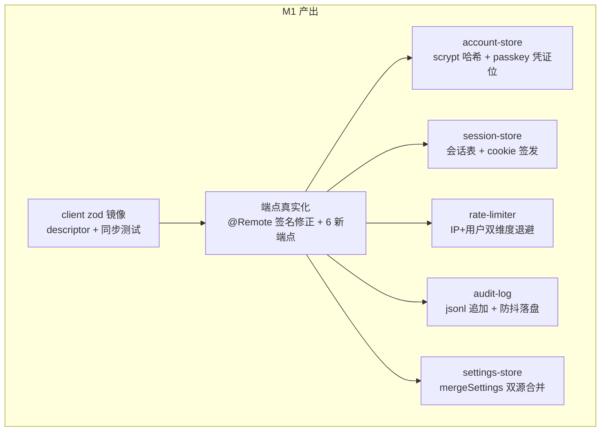
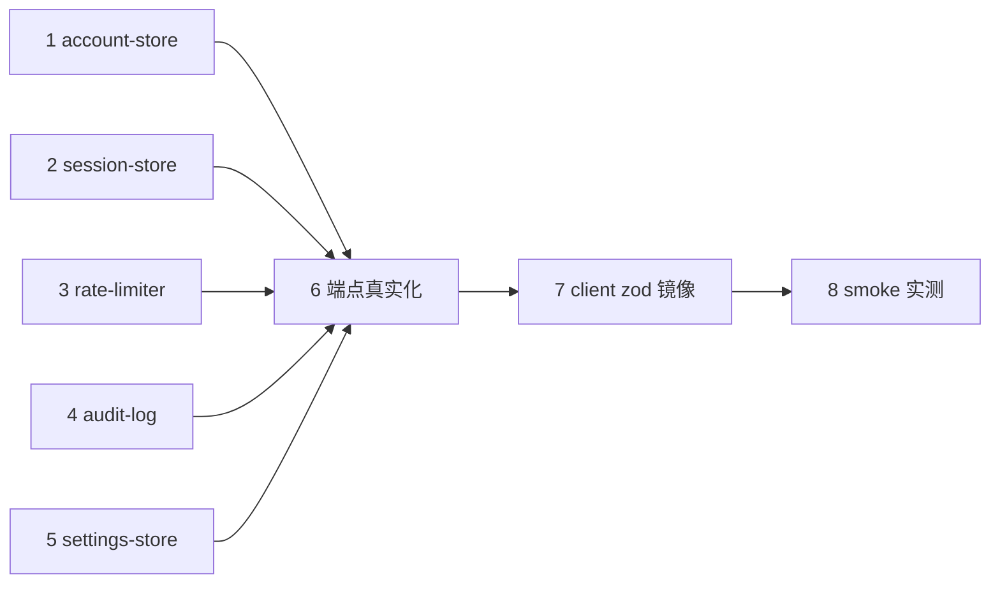

# M1 实施规划：host 核心业务模块装配

> 阶段定位：M0 骨架（蓝图 + 三层架构 + 构建产物）已完成；M1 装配账号/会话/
> 限速/审计/设置五个纯逻辑模块，端点从占位真实化，并完成 client 侧 zod 镜像。
> M2（安全入口服务器）依赖 M1 的端点与 SecurityDeps 真实化。

---

## 一、范围与目标



| 模块 | 依赖 | 可测性 |
|---|---|---|
| account-store | node:crypto + plugin-data | 纯函数 + mock fs |
| session-store | node:crypto（纯内存） | 纯函数 |
| rate-limiter | 无（纯内存） | 纯函数 |
| audit-log | plugin-data append 模式 | 纯函数 + mock fs |
| settings-store | plugin-data + contracts/settings | 纯函数 + mock fs |
| 端点真实化 | 上述五模块 | 注入 mock deps |
| client zod 镜像 | host 端点类型 | 解析 host 样本 |

---

## 二、关键设计决策

### D-M1-1：端点统一带 request 参数

调研确认：dsh-git-ui 的**每个** `@Remote` 方法都声明 `request` 参数（即便
`getPreset` 用 `_request` 占位），descriptor 也都声明 `parameters` 数组。
typert SRC/LIB 协议预期每个端点携带 request 参数——**我们骨架的无参端点
（status/logout/accountsList/settingsRead）需统一补 request 参数**（哪怕
`z.object({})` 空对象），作为 M1 第一道修正。

### D-M1-2：取消信号槽精简

git-ui 的 `storageRead/storageWrite/getPreset` 不带 `signal`（快速操作），
只给可能长时间的操作（snapshot/run/query）带 signal。M1 照此精简：
- `login`：scrypt 校验快，但限速等待场景带 signal 有理 → **保留**
- `auditRead`：文件分页读取可能慢 → **保留**
- 其余快速端点 → **移除 signal**

### D-M1-3：返回值信封策略

git-ui 混合使用：查询类直接返回业务类型；存储/预设类用 `RemoteEnvelope<T>`
（`{ ok: true, value } | { ok: false, error }`）包裹 IO 失败。M1 照此：
- 查询类（status/auditRead/accountsList/settingsRead）→ 直接返回业务类型
- 登录类（login）→ `LoginResult` 判别联合（已是 ok 信封形态）
- 写入类（accountCreate/settingsWrite 等新增端点）→ `RemoteEnvelope<T>` 包裹

### D-M1-4：accounts.json 数据结构与密码安全

```jsonc
{
  "v": 1,
  "accounts": [
    {
      "username": "admin",
      "passwordHash": "hex",          // scrypt 输出
      "salt": "hex",                  // 每用户随机 16 字节
      "scryptParams": { "N": 16384, "r": 8, "p": 1, "keyLen": 32 },
      "passkeys": [],                 // M3 填充
      "createdAt": 1700000000000,
      "updatedAt": 1700000000000
    }
  ]
}
```

密码哈希用 `node:crypto.scryptSync`（零依赖）；scrypt 参数存为元数据（便于
将来调整 N/r/p）；salt 每用户随机（`randomBytes(16)`）。版本信封 `v:1` +
`migrateAccounts` 机制（开发阶段无兼容包袱，但为将来留结构）。passkey 凭证
位预留（M3 填充 `{ credentialId, publicKey, counter, transports }`）。

**安全要求**（审计见 docs/security-audit-m1.md S3/M4/M5）：

- **假校验防用户名枚举**（S3）：`verifyPassword` 在用户名不存在时执行一次
  假 scrypt（用固定 DUMMY_SALT/DUMMY_PARAMS 哈希后丢弃结果），保证响应
  时间与真实校验一致——不泄露用户名存在性。
- **密码强度**（M4）：最小 12 字符 + 至少 1 数字 1 符号（OWASP 2023）；
  长度上限 1024 字节（防内存耗尽）。
- **用户名字符集**（M5）：`/^[a-zA-Z0-9_-]{1,64}$/`（create/update 时
  校验）——防审计日志/设置界面渲染的存储型 XSS 面。
- **恒定时间比较**：`crypto.timingSafeEqual` 比较哈希。

### D-M1-5：session-store 设计

- 会话 token：`randomBytes(32)` → base64url（256 bit）
- 内存 `Map<token, SessionEntry>`：`{ username, createdAt, lastAccessAt, ip }`
- TTL：**滑动续期**（每次访问更新 lastAccessAt；超过 ttlMinutes 清理）
- 清理：惰性（每次 login/logout 时扫一次过期项）+ 定时（`setInterval` 5 分钟）
- **重启失效**（内存态，安全默认——迫使重新登录，不残留长期会话）
- **单会话默认**（审计 M3）：create 时**撤销同 username 的旧会话**（防会话
  堆积 + 多设备登录无感知）；`maxSessionsPerUser` 可配置（默认 1，允许多
  设备时调高）
- Cookie 签发：`dsh_web_security_session=<token>; HttpOnly; Secure; SameSite=Strict; Path=/; Max-Age=<ttlSeconds>`（ttlMinutes × 60）
- Cookie 解析：从 `Cookie` 头解析 token → 查表 → 续期或拒绝

### D-M1-6：rate-limiter 设计

> 审计修正（S2）：typert gateway 的 `dispatchRpc(endpoint, payload, signal)`
> 只传业务参数 + 信号，**不传 HTTP 层客户端 IP**。`@Remote` 方法无法获取
> 请求 IP——IP 维度限速在端点层**不可实现**。限速分层：

| 层 | 维度 | 实现 | 数据来源 |
|---|---|---|---|
| M2 代理层 | IP + 全局 | HTTP 中间件 | socket 远端 / X-Forwarded-For |
| M1 端点层 | username | `@Remote` 方法 | request.username（业务参数） |

- 内存 `Map<username, { failures: number, firstFailAt: number, lockedUntil: number }>`
- 策略：`windowMinutes` 内 `maxAttempts` 次失败 → 锁定，**指数退避**
  （首次 1 min，逐次翻倍，上限 1 小时）
- `locked` 状态返回 `retryAfterMs`（剩余锁定时间）
- 清理：`windowMinutes` 过期后重置计数
- **接口签名修正**：`gate(username)` / `recordFailure(username)` /
  `recordSuccess(username)`——**无 IP 参数**（IP 维度归 M2 代理层）

```ts
export interface RateLimiter {
  gate(username: string): LoginGate
  recordFailure(username: string): void
  recordSuccess(username: string): void
}
```

### D-M1-7：audit-log 设计

- 追加模式（**非** atomicWrite 的整文件重写）：append 到 `audit.jsonl`
- 防抖落盘：内存缓冲队列 + 定时 flush（1s）或达到 50 条阈值 flush
- 读取分页：全量读（文件有 64 MiB 上限，全量可接受）+ 内存切片 offset/limit
- 格式：每行一个 JSON 事件（jsonl），与 `AuthEvent` 类型对齐
- flush 失败静默降级（不阻断登录等业务，审计丢失可接受）

### D-M1-8：settings-store + mergeSettings

- `settings.json` 读写用 `atomicWrite`（已有基础）
- **mergeSettings(preset, user, fallback)**（S3 遗留项）：
  - `preset` = config.defaultSettings（部署方 patch）
  - `user` = settings.json（用户设置）
  - `fallback` = DEFAULT_SETTINGS
  - 优先级：**user 字段 > preset 字段 > fallback**（逐字段合并，非整对象覆盖）
  - 逐字段校验：用户只改 `auditEnabled` 时，其余字段从 preset/fallback 继承
- `readSettings` 实现：
  `mergeSettings(config.defaultSettings, readSettingsJson(), DEFAULT_SETTINGS)`

### D-M1-9：端点公开/受保护标注（为 M2 留接口）

端点在 3080 上都是「本机可调用」（loopback 信任模型）；M2 代理层的认证门
决定谁能调哪个端点。M1 在端点契约里标注可见性，供 M2 规则消费：

| 端点 | 可见性 | 说明 |
|---|---|---|
| status | public | 登录页需要诊断信息；**不返回 hasAccounts**（审计 M1） |
| login | public | 未认证用户登录入口 |
| passkeyLoginBegin/Complete（M3） | public | 通行密钥登录入口 |
| logout / accountsList / accountUpdatePassword / accountRemove / settingsRead / settingsWrite / auditRead / passkeyRegister*（M3） | authenticated | 认证后可用 |
| accountCreate | **loopback-only** | **首次初始化悖论（审计 S1）**：仅 loopback 可调（部署方本机 CLI 初始化首个管理员），公网永不暴露初始化入口——防 TOCTOU 抢先初始化 |

**首次初始化策略**（S1 方案 A，最安全）：部署方在本机通过 loopback 调
`accountCreate` 创建首个管理员账号（`dsh` CLI 或 curl localhost:3080）。
公网入口只服务已初始化的部署。status 端点对未认证请求返回
`hasAccounts: null`（不泄露初始化状态）。

### D-M1-10：验证策略——独立测试 profile

当前 dsh web（3080）正在运行，安装到 web profile 需重启会中断会话。
M1 验证用**独立 profile**：

```bash
# 独立 profile + 独立端口 + 独立 home（隔离 plugin-data）
DSH_HOME="$PWD/.test-dsh-home" dsh --profile web-sec-test web --port 3081
# 安装到测试 profile
DSH_HOME="$PWD/.test-dsh-home" dsh plugin --profile web-sec-test add file:./release/dsh-web-security-0.1.0-test.tgz
```

独立 `DSH_HOME` 确保 plugin-data（账号/设置/审计）与生产隔离。

### D-M1-11：前置改动（模块开发前必须完成）

骨架的 `PluginDataFs` 切片只有 `mkdir/writeFile/rename`，**缺 `readFile`**——
account-store（读 accounts.json）、settings-store（读 settings.json）、
audit-log（读 audit.jsonl）三个模块都需要它。M1 第一步扩展：

```ts
// src/host/plugin-data.ts 扩展
export interface PluginDataFs {
  mkdir(...): Promise<string | undefined>
  writeFile(...): Promise<void>
  rename(...): Promise<void>
  readFile(path: string): Promise<string>  // 新增
}
export const nodeFs: PluginDataFs = {
  // ... 既有 + readFile: (path) => readFile(path, 'utf8')
}
```

随后修正 `@Remote` 签名（D-M1-1 统一带 request + D-M1-2 精简 signal）、
扩展 `SecurityEndpoints` 接口与请求/响应类型（第四节新增端点）——
**这三项是模块开发的前置门**。

---

## 三、模块规格

### 3.1 account-store（src/host/account-store.ts）

```ts
export interface AccountRecord {
  readonly username: string
  readonly passwordHash: string      // scrypt 输出 hex
  readonly salt: string             // hex
  readonly scryptParams: { N: number; r: number; p: number; keyLen: number }
  readonly passkeys: readonly PasskeyCredential[]  // M3 填充，M1 为空数组
  readonly createdAt: number
  readonly updatedAt: number
}

export interface AccountStore {
  /** 列表（仅元数据，绝不含哈希/盐）。 */
  list(): Promise<readonly AccountSummary[]>
  /** 按用户名查找完整记录（含哈希，仅 host 内部用）。 */
  find(username: string): Promise<AccountRecord | undefined>
  /** 创建账号；用户名已存在抛错。 */
  create(username: string, password: string): Promise<void>
  /** 改密码；旧密码不匹配抛错。 */
  updatePassword(username: string, current: string, next: string): Promise<void>
  /** 删除账号。 */
  remove(username: string): Promise<void>
  /** 是否有任何账号（首次初始化判定）。 */
  hasAny(): Promise<boolean>
}

export function createAccountStore(fs: PluginDataFs, root: string): AccountStore
```

**工厂签名**：`createAccountStore(fs, root)` —— 结构化注入 fs 切片（测试
可注入内存实现）。scrypt 参数固定为 `N=16384, r=8, p=1, keyLen=32`
（OWASP 2023 推荐）；哈希比较走**恒定时间**（`crypto.timingSafeEqual`）。

### 3.2 session-store（src/host/session-store.ts）

```ts
export interface SessionEntry {
  readonly token: string
  readonly username: string
  readonly createdAt: number
  lastAccessAt: number
  readonly ip: string
}

export interface SessionStore {
  /** 创建会话；返回 token + cookie 字符串。 */
  create(username: string, ip: string): { token: string; cookie: string }
  /** 按 token 查找并续期；返回会话或 undefined。 */
  resolve(token: string): SessionEntry | undefined
  /** 按 token 注销。 */
  revoke(token: string): void
  /** 惰性清理过期会话。 */
  sweep(): void
}

export function createSessionStore(ttlMinutes: number): SessionStore
```

纯内存；`create` 用 `randomBytes(32)` 生成 token；cookie 拼装
`dsh_web_security_session=<token>; HttpOnly; Secure; SameSite=Strict; Path=/; Max-Age=<ttl>`。

### 3.3 rate-limiter（src/host/rate-limiter.ts）

```ts
export interface RateLimiter {
  /** 查询登录门状态（未锁定放行；已锁定返回剩余时间）。 */
  gate(ip: string, username: string): LoginGate
  /** 登记一次失败（计数 + 判定锁定）。 */
  recordFailure(ip: string, username: string): void
  /** 登记一次成功（重置该 key 计数）。 */
  recordSuccess(ip: string, username: string): void
}

export function createRateLimiter(maxAttempts: number, windowMs: number): RateLimiter
```

指数退避：第 n 次锁定 `lockoutMs = min(60000 * 2^(n-1), 3600000)`
（1 min → 2 → 4 → ... → 1 h 上限）。

### 3.4 audit-log（src/host/audit-log.ts）

```ts
export interface AuditLog {
  /** 追加一条事件（入内存缓冲，防抖 flush）。 */
  append(event: AuthEvent): void
  /** 分页读取（最新在前）。 */
  read(offset: number, limit: number): Promise<{ events: readonly AuthEvent[]; hasMore: boolean }>
  /** 立即落盘（dispose 时调用）。 */
  flush(): Promise<void>
}

export function createAuditLog(fs: PluginDataFs, root: string, enabled: boolean): AuditLog
```

防抖 flush：`setInterval(flush, 1000)` + 阈值 50 条触发即时 flush；
`enabled = false` 时 append 静默 no-op（设置开关）。

### 3.5 settings-store（src/host/settings-store.ts）

```ts
export interface SettingsStore {
  /** 同步返回内存缓存（构造时异步加载；加载完成前回退 preset/fallback）。 */
  read(): SecuritySettings
  /** 写入用户设置（部分字段覆盖，与现有合并）。 */
  write(partial: Partial<SecuritySettings>): Promise<void>
}

export function createSettingsStore(
  fs: PluginDataFs, root: string, preset: unknown,
): SettingsStore
```

内存缓存模式（与 dsh-git-ui 同构）：`createSettingsStore` 同步工厂构造时
**fire-and-forget** 异步加载 settings.json 到内存缓存；加载完成前 `read()`
回退 `mergeSettings(preset, undefined, DEFAULT)`；`write()` 走
read-modify-merge-write（读现有 user → 合并 partial → 校验 → 原子写 →
刷新缓存）。`SecurityDeps.readSettings()` 因此保持同步签名。

---

## 四、端点规格（M1 修正后）

### 4.1 签名修正（D-M1-1 + D-M1-2）

```ts
// 每个端点统一带 request 参数；仅 login/auditRead 带 signal（D-M1-2）
@Remote('status')      async status(request: StatusRequest): Promise<SecurityStatus>
@Remote('login')      async login(request: LoginRequest, signal?: AbortSignal): Promise<LoginResult>
@Remote('logout')      async logout(request: LogoutRequest): Promise<void>
@Remote('accountsList') async accountsList(request: AccountsListRequest): Promise<readonly AccountSummary[]>
@Remote('auditRead')   async auditRead(request: AuditReadRequest, signal?: AbortSignal): Promise<AuditReadResult>
@Remote('settingsRead') async settingsRead(request: SettingsReadRequest): Promise<SecuritySettings>
```

### 4.2 新增端点（M1）

```ts
@Remote('accountCreate')        async accountCreate(request: AccountCreateRequest): Promise<RemoteEnvelope<void>>
@Remote('accountUpdatePassword') async accountUpdatePassword(request: AccountUpdatePasswordRequest): Promise<RemoteEnvelope<void>>
@Remote('accountRemove')        async accountRemove(request: AccountRemoveRequest): Promise<RemoteEnvelope<void>>
@Remote('settingsWrite')        async settingsWrite(request: SettingsWriteRequest): Promise<RemoteEnvelope<SecuritySettings>>
```

`StatusRequest/LogoutRequest/AccountsListRequest/SettingsReadRequest` 为
`z.object({})` 空对象（满足 SRC 参数契约，client 侧空 args 调用）。

### 4.3 完整端点清单

| 端点 | 参数 | 返回 | signal | 可见性 |
|---|---|---|---|---|
| status | StatusRequest {} | SecurityStatus | — | public |
| login | LoginRequest | LoginResult | ✓ | public |
| logout | LogoutRequest {} | void | — | authenticated |
| accountsList | AccountsListRequest {} | readonly AccountSummary[] | — | authenticated |
| accountCreate | AccountCreateRequest | RemoteEnvelope\<void\> | — | authenticated |
| accountUpdatePassword | AccountUpdatePasswordRequest | RemoteEnvelope\<void\> | — | authenticated |
| accountRemove | AccountRemoveRequest | RemoteEnvelope\<void\> | — | authenticated |
| settingsRead | SettingsReadRequest {} | SecuritySettings | — | authenticated |
| settingsWrite | SettingsWriteRequest | RemoteEnvelope\<SecuritySettings\> | — | authenticated |
| auditRead | AuditReadRequest | AuditReadResult | ✓ | authenticated |

---

## 五、开发顺序与依赖



**1–5 可并行**（无相互依赖，纯逻辑模块）；6 依赖 1–5 装配 SecurityDeps；
7 依赖 6 的端点类型；8 最后。建议每完成一个模块即 `tsc + vitest` 把关。

---

## 六、验证关卡

### 关卡 1：无参端点 SRC 实测（M1 首要）

骨架的 4 个无参端点在补 request 参数后，仍需**实测确认** typert LIB 校验
与 Gateway 分发接受 `z.object({})` 空参数。这是 M1 第一个关卡——若 LIB
拒绝，端点设计需返工。用独立测试 profile（D-M1-10）验证。

### 关卡 2：scrypt 恒定时间比较

`verifyPassword` 必须用 `crypto.timingSafeEqual` 比较哈希，防时序侧信道。
单测覆盖：正确密码、错误密码、不存在用户名（统一返回 false，不泄露存在性）。

### 关卡 3：会话滑动续期与重启失效

单测覆盖：创建 → 续期 → 过期清理；重启（重新 createStore）→ 旧 token 失效。

### 关卡 4：限速指数退避

单测覆盖：逐步失败 → 锁定 → 退避递增 → 上限 1h → 窗口过期重置。

### 关卡 5：审计防抖落盘与读取

单测覆盖：append → 缓冲 → flush → 文件内容正确 → 分页读取 → hasMore。

### 关卡 6：mergeSettings 逐字段合并

单测覆盖：user 部分字段 + preset 部分字段 + fallback 补齐 → 逐字段优先级正确。

---

## 七、SecurityDeps 扩展

骨架的 `SecurityDeps` 将从占位扩展为真实装配面：

```ts
export interface SecurityDeps {
  // 已有
  verifyPassword(username: string, password: string): Promise<boolean>
  loginGate(ip: string, username: string): Promise<LoginGate>
  recordFailure(ip: string, username: string): Promise<void>
  recordEvent(event: AuthEvent): void
  readSettings(): SecuritySettings
  // M1 新增
  createSession(username: string, ip: string): { token: string; cookie: string }
  resolveSession(token: string): SessionEntry | undefined
  revokeSession(token: string): void
  listAccounts(): Promise<readonly AccountSummary[]>
  createAccount(username: string, password: string): Promise<void>
  updatePassword(username: string, current: string, next: string): Promise<void>
  removeAccount(username: string): Promise<void>
  hasAccounts(): Promise<boolean>
  writeSettings(partial: Partial<SecuritySettings>): Promise<void>
  readAudit(offset: number, limit: number): Promise<{ events: readonly AuthEvent[]; hasMore: boolean }>
}
```

SecurityService 构造时装配五个模块实例，buildDeps 返回委托闭包。
端点方法从 deps 取数据，**自身不含业务逻辑**（仅委托壳 + 可选横切如
`recordEvent` 在 login 成功后追加审计）。

---

## 八、client zod 镜像（src/client/remote.ts）

M1 首次产出 client 侧 descriptor——与 host 端点类型**手写同步**，
`tests/client/remote.spec.ts` 解析 host 样本守护一致性（指南 7.2）。

```ts
// 示例：login 端点 descriptor
{
  id: 'dsh-web-security#security/login',
  service: 'security', namespace: 'security', method: 'login',
  invocation: { kind: 'direct' },
  cancellation: { parameter: 'signal' },
  parameters: [{
    name: 'request', wire: 'request', source: 'json',
    codec: { mode: 'strict', typeSymbol: 'dsh-web-security/types#LoginRequest', schema: loginRequestSchema },
  }],
  result: { mode: 'strict', typeSymbol: 'dsh-web-security/types#LoginResult', schema: loginResultSchema },
}
```

M1 镜像所有端点（10 个）；M4 client 设置界面消费这些 schema 调用端点。

---

## 九、文件产出清单

| 文件 | 内容 |
|---|---|
| `src/host/account-store.ts` | scrypt 哈希 + 账号 CRUD |
| `src/host/session-store.ts` | 会话表 + cookie 签发 |
| `src/host/rate-limiter.ts` | IP+用户双维度退避 |
| `src/host/audit-log.ts` | jsonl 追加 + 防抖落盘 |
| `src/host/settings-store.ts` | mergeSettings 双源合并 |
| `src/contracts/host-endpoints.ts` | 扩展端点接口 + 新增请求/响应类型 |
| `src/host/index.ts` | SecurityDeps 真实装配 + @Remote 签名修正 |
| `src/client/remote.ts` | zod descriptor 镜像（M1 首个 client 产出） |
| `tests/account-store.spec.ts` | scrypt + CRUD 单测 |
| `tests/session-store.spec.ts` | 会话生命周期单测 |
| `tests/rate-limiter.spec.ts` | 退避单测 |
| `tests/audit-log.spec.ts` | 追加/读取单测 |
| `tests/settings-store.spec.ts` | mergeSettings 单测 |
| `tests/client/remote.spec.ts` | zod 镜像同步测试 |
| `tests/smoke-host.mjs` | 构建后真实宿主载荷冒烟（恢复 package.json smoke script） |

---

## 十、不在 M1 范围（边界声明）

- **安全入口服务器**（TLS + 认证门 + 反向代理）→ M2
- **通行密钥实现**（@simplewebauthn/server v13 集成）→ M3（account-store 预留 passkey 位）
- **设置界面 UI**（React slots）→ M4
- **微信扫码等第三方登录**→ 未来扩展
