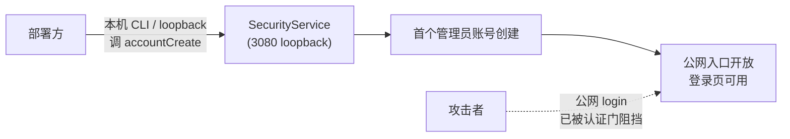

# 安全审计报告：dsh-web-security M0 骨架与 M1 规划

> 审计视角：漏洞发掘专家（攻击者视角） · 审计范围：全部产出代码 + 设计文档
> · 审计日期：M1 规划完成后

---

## 一、审计范围与方法

逐文件通读 `src/` 全部源码（14 文件）、`docs/` 两份设计文档（蓝图 + M1
规划）、`tests/` 单测，并对照宿主 v0.1.1-rc.2 源码验证平台约束假设。
以攻击者视角模拟利用路径，发掘设计盲点与实现缺陷。

---

## 二、发现汇总


| 编号 | 严重度 | 标题 |
|---|---|---|
| S1 | 🔴 严重 | 首次初始化悖论——accountCreate 与首次无账号的矛盾 |
| S2 | 🔴 严重 | typert 端点无法获取客户端 IP——IP 维度限速不可行 |
| S3 | 🔴 严重 | 用户名枚举时序攻击——不存在用户名的快速路径泄露存在性 |
| M1 | 🟡 中等 | status 端点向未认证请求泄露 hasAccounts |
| M2 | 🟡 中等 | 安全降级操作（关审计/降限速）无审计事件 |
| M3 | 🟡 中等 | 并发会话无限制（新登录不撤销旧会话） |
| M4 | 🟡 中等 | 密码强度策略缺失 |
| M5 | 🟡 中等 | 用户名字符集未限制（存储型 XSS 面） |
| M6 | 🟡 中等 | WebAuthn RP ID 配置位缺失 |
| M7 | 🟡 中等 | 限速/会话参数范围过宽（maxAttempts 上限 100） |
| L1 | 🟢 低危 | atomicWrite 缺 fsync（崩溃丢数据） |
| L2 | 🟢 低危 | TLS 证书路径未校验穿越/符号链接/TOCTOU |
| L3 | 🟢 低危 | 审计日志渲染 XSS（M4 设置界面） |
| L4 | 🟢 低危 | settings 写并发丢失更新（低频可接受） |
| L5 | 🟢 低危 | 测试脚本 DSH_HOME 缺失保护（污染生产数据） |

---

## 三、严重发现详析

### S1：首次初始化悖论

**漏洞描述**：M1 规划 D-M1-9 将 `accountCreate` 标为 `authenticated`
（认证后可用）。但首次部署时系统无任何账号 → 无法认证 → **无法创建
第一个管理员账号**。蓝图 D2 提到「未初始化 → 前端显示初始化向导」，但
初始化向导如何调用 accountCreate 未定义。

**攻击场景**：若初始化向导让 accountCreate 在 `hasAccounts=false` 时对
公网 public，则存在 **TOCTOU 抢先初始化**——攻击者先于合法管理员完成
初始化，创建自己的管理员账号，永久接管部署。

**修复方案**（推荐方案 B）：



- **方案 A**（最安全，有摩擦）：首次初始化**仅 loopback**——部署方在本机
  用 CLI 工具或直接调 `127.0.0.1:3080/api/security/accountCreate`（loopback
  天然信任）。公网永远不暴露初始化入口。status 端点对未认证请求**不返回
  hasAccounts**。
- **方案 B**（平衡）：config 预设初始管理员密码哈希
 （`config.initialAdmin.hash` + `salt`）；首次登录后强制改密。公网登录页
  检测到未初始化时用此哈希校验初始密码。部署方在 patch.yml 设定。
- **方案 C**（不推荐）：公网初始化向导 + 一次性初始化令牌（config 预设）。

**归属**：M1 规划 D-M1-9 + 蓝图 D2 修正。

### S2：typert 端点无法获取客户端 IP

**漏洞描述**：M1 规划 D-M1-6 的 rate-limiter 设计为「IP+用户名双维度」。
但审计宿主源码确认：typert gateway 的 `dispatchRpc(endpoint, payload, signal)`
**只传 endpoint + payload + signal**，`@Remote` 方法只收到 `request`（业务参数）
和 `signal`——**无法获取 HTTP 请求的客户端 IP**。

**影响**：若 rate-limiter 从 socket 远端取 IP，M2 代理模式下所有请求的
远端都是 `127.0.0.1`（代理本身）→ **IP 维度限速完全失效**，所有用户共享
一个 IP 槽 → 单用户锁定即全员锁定（或完全不锁定）。

**修复方案**：限速分层——

| 层 | 维度 | 实现 | 数据来源 |
|---|---|---|---|
| M2 代理层 | IP + 全局 | HTTP 中间件 | socket 远端 / X-Forwarded-For |
| M1 端点层 | username | typert `@Remote` | request.username（业务参数） |

M1 的 rate-limiter **只做 username 维度**（`gate(username)` / `recordFailure(username)`）；
IP 维度限速归 M2 代理层（代理有真实 HTTP 层 IP）。

**归属**：M1 规划 D-M1-6 接口签名修正 + M2 规划新增 IP 限速层。

### S3：用户名枚举时序攻击

**漏洞描述**：M1 规划 D-M1-4 提到「恒定时间比较
（`crypto.timingSafeEqual`）」，但**只保证比较阶段恒定时间**。若
`account-store.find(username)` 返回 `undefined`（用户名不存在）时立即
返回 false（不做 scrypt），攻击者可通过响应时间区分：
- 用户名**存在** → 执行 scrypt（慢，~50ms）
- 用户名**不存在** → 立即返回（快，~1ms）

**利用**：攻击者枚举用户名列表，按响应时间筛选存在的用户名，再针对性
爆破密码。

**修复方案**：用户名不存在时执行**假校验**（dummy scrypt）——用固定
假哈希 + 随机 salt 做一次 scryptSync + timingSafeEqual（结果恒为 false，
但耗时与真实校验一致）：

```ts
const DUMMY_HASH = '<precomputed scrypt of "dummy" with fixed salt>'
async function verifyPassword(username: string, password: string): Promise<boolean> {
  const record = await store.find(username)
  if (record === undefined) {
    // 假校验：保持与真实校验相同的耗时，防用户名枚举
    scryptSync(password, DUMMY_SALT, DUMMY_PARAMS)
    timingSafeEqual(DUMMY_HASH_BUFFER, DUMMY_HASH_BUFFER) // 恒 true 但丢弃结果
    return false
  }
  // 真实校验
  const hash = scryptSync(password, record.salt, record.scryptParams)
  return timingSafeEqual(hash, record.passwordHashBuffer)
}
```

**归属**：M1 规划 D-M1-4 补充假校验要求 + account-store 实现遵守。

---

## 四、中等发现

### M1：status 端点泄露 hasAccounts

未认证的 status 返回 `hasAccounts: boolean`，泄露初始化状态（侦察价值：
攻击者知道目标是否「新鲜未初始化」→ 配合 S1 的 TOCTOU 抢先初始化）。

**修复**：status 对未认证请求**不返回 hasAccounts**（字段设为 `null` 或
省略）；authenticated 请求才返回真实值。或配合 S1 方案 A（loopback 初始化）
后，status 永不返回 hasAccounts（登录页不需要）。

### M2：安全降级操作无审计

`settingsWrite` 可关闭审计（`auditEnabled: false`）、增大 `maxLoginAttempts`
（降低限速）、延长 `sessionTtlMinutes`（延长会话）——这些都是**安全降级
操作**，应触发审计事件 `settings-changed`（`AuthEventKind` 已有）。

M1 规划未要求 settingsWrite 端点实现追加审计。

**修复**：settingsWrite 端点实现时 `deps.recordEvent({ kind: 'settings-changed',
actor: <当前用户>, detail: <变更字段> })`。

### M3：并发会话无限制

session-store 的 create 每次生成新 token，**不撤销同用户旧会话**。攻击者
用有效凭证可创建无限会话（内存泄漏 + 多设备登录无感知）。

**修复**：create 时**撤销同 username 的旧会话**（默认单会话），或限制
`maxSessionsPerUser`（可配置，默认 1，允许多设备时调高）。

### M4：密码强度策略缺失

accountCreate / accountUpdatePassword 接受任意密码（包括空字符串、1 字符）。

**修复**：最小 12 字符 + 至少 1 数字 1 符号（OWASP 2023 推荐）；密码
长度上限 1024 字节（防内存耗尽，scrypt 内部 PBKDF2 已固定长度无 DoS）。

### M5：用户名字符集未限制

用户名未限制字符集——可能包含 `<script>`、换行、路径分隔符等。虽然
accounts.json 是单文件（用户名是字段值非文件名），但用户名会在审计日志、
设置界面、登录页渲染——**存储型 XSS 面**。

**修复**：用户名正则 `/^[a-zA-Z0-9_-]{1,64}$/`（create/update 时校验）。

### M6：WebAuthn RP ID 配置位缺失

M3 passkey 需要 RP ID（部署域名，如 `example.com`），与部署域名绑定。
当前 config schema 无 `rpID` 字段，M1 account-store 预留 passkey 位但
RP ID 来源未定义。

**修复**：SecurityConfig 加 `rpID: string`（部署方在 patch.yml 设定，
如 `rpID: 'sec.example.com'`）。M1 在 config schema 预留。

### M7：限速/会话参数范围过宽

`SETTINGS_RANGES.maxLoginAttempts` 上限 100（允许 100 次失败才锁定 →
限速形同虚设）；`sessionTtlMinutes` 上限 43200（30 天 → 会话过长）。

**修复**：

| 字段 | 当前范围 | 修正范围 | 理由 |
|---|---|---|---|
| maxLoginAttempts | 1–100 | 3–10 | 安全插件不应允许超过 10 次失败 |
| sessionTtlMinutes | 5–43200 | 5–10080 | 最大 7 天 |
| rateLimitWindowMinutes | 1–1440 | 1–1440 | 保持（24h 合理） |

---

## 五、低危发现

### L1：atomicWrite 缺 fsync

`atomicWrite` 写临时文件后直接 rename，**未 fsync**。崩溃时 page cache
数据可能未落盘 → 数据丢失或半截文件。rename 保证读者只见完整内容
（原子性 ✓），但崩溃持久性无保证。

**影响**：审计日志丢失部分条目（设计已接受「落盘失败不阻断业务」）；
账号丢失（可用性问题）。

**修复**：M1 实现 atomicWrite 真实使用时，用 `fh.sync()` fsync 临时文件
再 rename。需扩展 PluginDataFs 加 `open` 或在 nodeFs 直接用 node:fs/promises
的 FileHandle。

### L2：TLS 证书路径未校验

`normalizeConfig` 对 `certPath/keyPath` 只校验非空字符串，不校验路径
穿越（`../../etc/passwd`）、符号链接、TOCTOU。M2 加载 TLS 证书时需校验。

### L3：审计日志渲染 XSS

审计事件的 `username/detail` 字段可能含恶意 HTML。M4 设置界面展示审计
时若未转义 → 存储型 XSS。M4 实现注意。

### L4：settings 写并发丢失更新

`read-modify-merge-write` 非原子——并发 write 可能丢失中间更新。设置
写入低频，可接受；M1 可加文件锁或版本号乐观锁。

### L5：测试 DSH_HOME 缺失保护

测试脚本若忘了设 `DSH_HOME`，plugin-data 会写到生产 `~/.dsh/`。应在
smoke 脚本或 vitest setup 强制检查 `DSH_HOME` 已设且非 `~/.dsh`。

---

## 六、修复优先级与归属

| 编号 | 修复归属 | 阶段 |
|---|---|---|
| S1 | M1 规划 D-M1-9 + 蓝图 D2 修正 | M1 文档 |
| S2 | M1 规划 D-M1-6 签名修正 + M2 新增 IP 限速层 | M1 文档 + M2 |
| S3 | M1 规划 D-M1-4 补充假校验 + account-store 实现 | M1 文档 + 实现 |
| M1 | M1 规划 SecurityStatus 修正 | M1 文档 |
| M2 | M1 规划 settingsWrite 审计要求 | M1 文档 |
| M3 | M1 规划 D-M1-5 单会话默认 | M1 文档 |
| M4 | M1 规划 D-M1-4 密码强度 | M1 文档 |
| M5 | M1 规划 D-M1-4 用户名字符集 | M1 文档 |
| M6 | M1 规划 config schema 加 rpID | M1 文档 |
| M7 | contracts/settings.ts SETTINGS_RANGES 收紧 | M0 代码（立即） |
| L1 | M1 实现 atomicWrite 时加 fsync | M1 实现 |
| L2 | M2 TLS 加载时校验 | M2 |
| L3 | M4 审计渲染转义 | M4 |
| L4 | M1 settings 写加锁（可选） | M1 |
| L5 | M1 smoke 脚本 DSH_HOME 检查 | M1 实现 |

**立即修复**（M0 代码）：M7（SETTINGS_RANGES 收紧）——这是当前代码中
唯一可以立即修复的安全参数问题。
