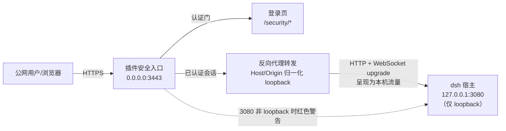
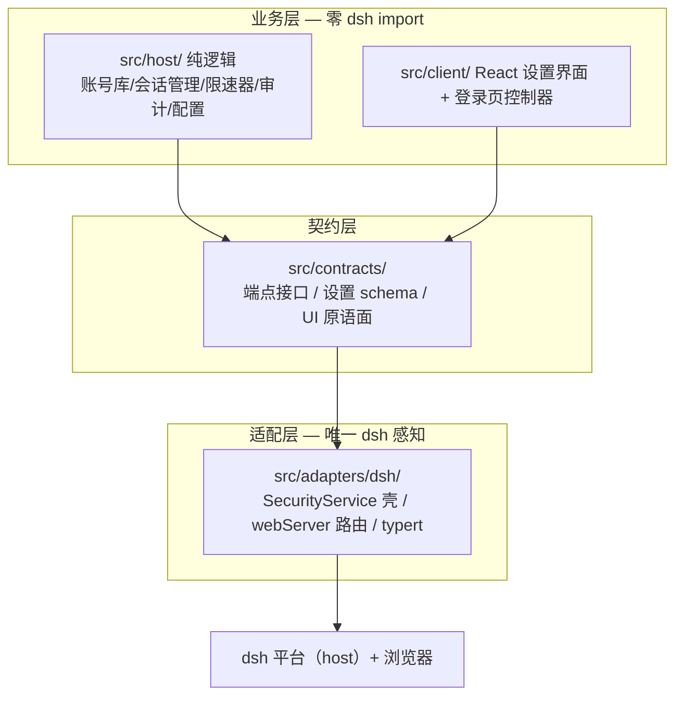
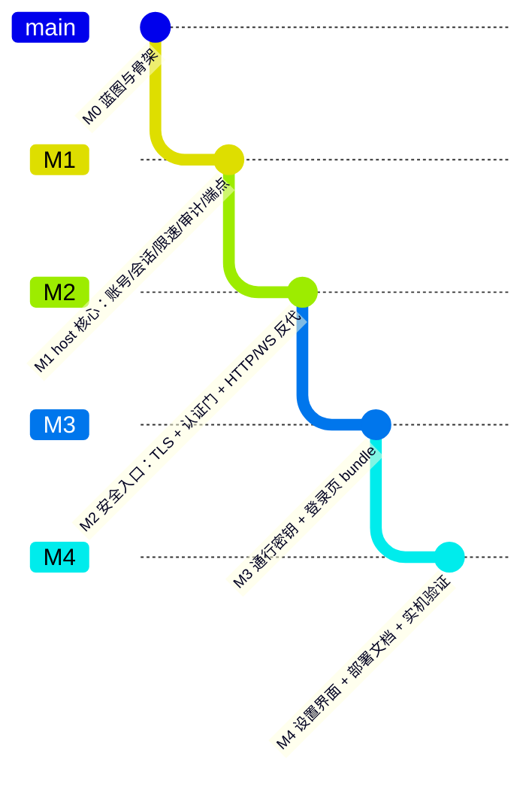

# dsh-web-security 插件设计蓝图

> 状态：第 0 阶段（规划与骨架）· 依据 `.wiki/dsh-plugin-development-guide.md` 与宿主 v0.1.1-rc.2 源码调研

---

## 一、定位与目标

dsh（DeepSeek Harness）的 web-ui 目前监听 `127.0.0.1:3080`，**没有任何认证层**
（宿主源码明言 `isTrustedApiRequest` 的 Host/Origin 围栏「not an auth layer」）。
用户希望在公网部署 dsh 随时访问，但直接暴露意味着任何人都能操作 agent、读取会话。
本插件为 dsh web-ui 提供**外部安全访问入口**：

- 高安全性登录界面：账号密码 + 通行密钥（WebAuthn/passkey），后期可扩展微信扫码等第三方登录；
- 插件自持安全入口：TLS 终止 + 会话认证 + 反向代理到宿主 loopback 端口；
- 配置中心：宿主设置界面可配置安全策略（入口端口、TLS 证书、会话时长、限速等）。

---

## 二、平台约束调研结论（决定架构的关键事实）

对宿主 v0.1.1-rc.2 源码逐层确认：

| 面 | 宿主机制 | 结论 |
|---|---|---|
| HTTP 服务器 | `dsh-host-webserver`：exact/prefix 路由 + 唯一 fallback 座位 + index 注入 | **无中间件/认证钩子** |
| RPC（`/api`） | `connection` 注册 prefix `/api`；`typertGateway` 独占唯一 interceptor | **插件无法在 /api 上再挂认证拦截**（重复注册即抛错） |
| 特权方法 | `PRIVILEGED_METHODS`（settings.update/mutate、credentials.*、host.openPath 等 14 个）额外经**空信任表**校验，**钉死 loopback Host** | 配置 `trustedHosts` 也无法让远程访问使用这些方法 |
| WebSocket | `connection` 注册 `/api/events.mux`、`/api/events.host` 两个 upgrade 路由，handler 内同样过信任围栏 | upgrade 表按 exact path 唯一，同样无法拦截 |
| 静态 SPA | `frontend-static` 独占 fallback 座位（仅 GET/HEAD） | 插件不可抢占 |
| 跨站围栏 | `isTrustedApiRequest`：Host fence + Origin fence + Fetch-Metadata | 只防 DNS rebinding/跨站，**不是认证** |
| LAN 自动信任 | web 绑定 `0.0.0.0` 时，CLI 把本机 LAN IPv4 字面量自动并入 `trustedHosts`（`resolveLanTrust`） | LAN 设备可**绕过任何插件认证直连 3080 API**（宿主行为，插件只能警告） |
| 部署配置面 | profile `cordis.patch.yml` 支持 `- id: <row> config: {...}` 整配置覆盖；CLI `--trusted-host` | 围栏权威的官方来源（本插件方案下不再需要，见 D4） |

**核心推论**：认证**无法**寄生在 3080 的请求链上。安全入口只能在「传输层之上、宿主之外」——
插件自持一个 HTTPS 入口，认证通过后将流量反向代理到 loopback 3080。
这也是唯一的完整方案：curl 直接打 /api 都拿不到任何数据。



---

## 三、架构决策

### 3.1 决策 D1：反向代理安全入口（而非前端遮罩）

- ❌ 前端遮罩方案（index 注入登录页 + client 拦截）：能挡住普通访客，但 `/api` 直接 curl 可访问，**不安全**，作废。
- ❌ 抢占 `/api` 或 fallback：宿主注册表互斥，作废。
- ✅ **插件自持 HTTPS 入口 + 认证 + 反向代理**：所有流量（HTTP 与 WebSocket upgrade）经认证门；3080 保持 loopback 裸奔不可能。

### 3.2 决策 D2：未认证一律只见登录页

- 未认证的任何路径请求 → 重定向/返回登录页（`/security/login`），**SPA 的字节都不泄露**；
- `/security/*`（登录页、登录/登出/状态端点）放行，其余全部门禁；
- 登录成功 → 下发会话 Cookie → 302 回 `/` → 之后全部透明代理。

### 3.3 决策 D3：会话与凭据

- 会话：服务端内存表（随机 256-bit token），Cookie `HttpOnly + Secure + SameSite=Strict + Path=/`，滑动 TTL；**重启即全员下线**（安全默认）；
- 密码：`node:crypto.scrypt` + 每用户随机 salt（零依赖），校验走恒定时间比较；
- 通行密钥：`@simplewebauthn/server`（RP 校验/挑战），前端 `@simplewebauthn/browser`；
- 登录限速：IP + 用户名双维度失败计数，指数退避锁定；
- 审计：`audit.jsonl`（登录成败、登出、账号变更、安全配置变更），文件名白名单 + 原子写。

### 3.4 决策 D4：代理对上游「归一化为本机流量」（而非保留外部 Host）

> 二次复审修订：初版方案是「Host 保留外部权威 + 部署方配置 `trustedHosts`」。
> 复核宿主源码后否决——`connection` 对 `PRIVILEGED_METHODS`（settings.update、
> credentials.* 等 14 个方法）额外经**空信任表**校验，**钉死 loopback**：即使配了
> trustedHosts，远程登录用户也无法使用设置界面等特权功能，直接违背本插件
> 「配置在 dsh 设置界面完成」的核心需求。

采用**上游归一化代理**：认证通过后，转发时把请求呈现为标准本机流量——

- `Host` 改写为上游权威（`127.0.0.1:<port>`）→ Host fence 与特权方法的
  空信任表检查均按 loopback 通过；
- 浏览器附带的 `Origin` 改写为与改写后 Host 同源 → Origin fence 通过；
- `sec-fetch-site` 非 cross-site（浏览器对同站 API 本就不发 cross-site）；
- 补充 `X-Forwarded-For/Proto/Host` 传递真实来源（审计与日志用）。

安全性论证：围栏的防御目标（DNS rebinding、跨站请求）在入口层已由**认证门**
承担——未认证流量根本到不了转发器；能穿过认证门的流量等价于「已认证的本机
用户」。3080 视角一切请求来自 loopback socket + loopback Host，与本机浏览器
访问完全同构。

收益：**部署零配置**（无需 `--trusted-host` 或 patch 覆盖 connection row）、
特权方法全可用、上游视角单一。

### 3.5 决策 D5：登录页为独立零框架 bundle

登录发生在 dsh shell boot **之前**，React 不可用 → 登录页为原生 TypeScript
独立 bundle（WebAuthn 原生 API 可行），由插件注册的 `/security/*` 路由服务；
样式优先使用 `--dsw-alias-*` 变量（宿主 CSS 注入后自适应明暗）。设置界面走
client 半（React slots），在登录后的 dsh 设置页内配置。

### 3.6 决策 D6：设置双源合并

与 dsh-git-ui 同构：部署方 preset（patch `config`，可覆盖安装即用默认值）+
用户 `settings.json`（plugin-data 存储，经 storage RPC 读写）+ 代码内
`DEFAULT_SETTINGS`。安全敏感项（账号、TLS 私钥路径等）只经 host 侧管理端点，
**绝不下发到浏览器**。

---

## 四、三层目录与模块划分



| 目录/文件 | 职责 | 阶段 |
|---|---|---|
| `src/contracts/host-endpoints.ts` | 安全端点纯接口（status/login/logout/accounts/settings/audit/passkey） | M1 |
| `src/contracts/settings.ts` | 安全设置 schema + `DEFAULT_SETTINGS` + 校验 | M1 |
| `src/contracts/auth-events.ts` | 登录/登出/锁定事件类型（审计与 UI 共用） | M1 |
| `src/host/account-store.ts` | 账号持久化（scrypt 哈希 + salt）、账号 CRUD | M1 |
| `src/host/session-store.ts` | 会话表（token、TTL、滑动续期）、Cookie 解析/签发 | M1 |
| `src/host/rate-limiter.ts` | 登录限速（IP+用户双维度） | M1 |
| `src/host/audit-log.ts` | 审计追加（防抖 + 原子写 + 白名单） | M1 |
| `src/host/settings-store.ts` | settings.json 读写（原子写、上限） | M1 |
| `src/host/proxy.ts` | HTTP + WebSocket upgrade 反向代理转发器（手写，无依赖） | M2 |
| `src/host/entry-server.ts` | TLS/HTTP 入口服务器 + 认证门 + 路由分发 | M2 |
| `src/host/webauthn.ts` | WebAuthn 注册/认证服务器（@simplewebauthn） | M3 |
| `src/client/login/` | 登录页 bundle 源（原生 TS，独立构建入口） | M3 |
| `src/client/settings/` | 设置界面（React slots + schema-form） | M4 |
| `src/adapters/dsh/index.ts`（host 壳） | SecurityService（`@Remote` 委托 + webServer 路由注册 + 生命周期） | M1 起 |
| `src/adapters/dsh/client-adapter.ts` | client 平台适配（参照 dsh-git-ui） | M4 |

---

## 五、端点契约草案（typert `security` 命名空间）

```ts
interface SecurityEndpoints {
  status(): { enabled, authenticated?, hasAccounts, entryInfo, diagnostics }
  login(request: { username, password }): { ok } | { code: 'bad-credentials' | 'locked' }
  logout(): void
  // —— 以下均为已认证端点（设置在 3080 上亦是插件自己的受保护数据）——
  accountsList(): AccountSummary[]               // 只含元数据，绝不含哈希
  accountCreate(request: { username, password })
  accountUpdatePassword(request: { current, next })
  accountRemove(request: { username })
  passkeyRegisterBegin() / passkeyRegisterComplete(request: { credential })
  passkeyLoginBegin() / passkeyLoginComplete(request: { assertion })
  settingsRead() / settingsWrite(request: settings)
  auditRead(request: { offset, limit })
}
```

> `signal` 末位参数槽遵循 SRC 反射契约；client 侧 zod 镜像同步维护（M1 起）。

---

## 六、数据与持久化

| 数据 | 位置 | 说明 |
|---|---|---|
| 账号与 passkey 凭证 | `<home>/plugin-data/dsh-web-security/accounts.json`（0600） | 原子写；密码 scrypt 哈希 |
| 用户设置 | `.../settings.json` | 原子写 + 大小上限 |
| 审计日志 | `.../audit.jsonl` | 追加 + 防抖落盘，落盘失败不阻断业务 |
| 会话 | 进程内存 | 重启失效（安全默认） |

---

## 七、阶段规划



| 阶段 | 验收 |
|---|---|
| M0（本次） | 蓝图 + 可构建骨架（typecheck/build 断言过） |
| M1 | 纯函数单测全绿；`security` 端点可经 typert 调用；账号/会话/审计落盘正确 |
| M2 | 入口 404/401/302 正确；HTTP 与 WebSocket 全透传；Origin/Host 围栏通过 |
| M3 | passkey 注册与认证闭环；登录页在未认证时正确呈现并可登录 |
| M4 | 设置界面可配置；`reinstall.sh` 闭环实机验证；发布前三轮复审 |

---

## 八、风险与未决问题

1. **自签证书 vs WebAuthn**：passkey 要求 secure context，自签证书需用户手动信任；
   生产建议提供受信证书路径（Let's Encrypt 等）。M3 文档化。
2. **3080 裸露 = LAN 自动放行**：部署方把 webserver 绑到 `0.0.0.0` 时，宿主 CLI
   会把本机 LAN IPv4 字面量**自动并入 `trustedHosts`**（`resolveLanTrust`）——
   LAN 内设备可绕过本插件认证门直连 3080 API。插件无法回收该行为，只能：
   设置界面红色警告 + 文档强调「安全入口模式下 3080 必须保持 loopback 绑定」。
3. **本机信任边界不变**：3080 上的 `security` 管理端点（账号/设置）对本机进程
   开放且无认证——这与 dsh 现状一致（本机任何进程本就能控制 agent、读写会话）。
   本插件的威胁模型是「外部访问者」，不收窄本机信任边界；如需收窄属后续版本。
4. **入口端口占用**：默认 3443 可配；启动失败（占用/TLS 错误）明确报错并降级为「仅诊断」。
5. **多实例/profile 冲突**：入口服务器按 profile 隔离，`plugin-data` 按插件名隔离（平台约定）。

---

## 九、M1 待办清单（含二次复审遗留项）

| 项 | 说明 |
|---|---|
| mergeSettings 双源合并 | `validateSettings` 现为全量校验语义；settings.json 的「部分字段覆盖」需按字段合并 + 逐字段校验（蓝图 D6 承诺的语义） |
| 无参端点 SRC 实测 | 骨架的 status/logout/accountsList/settingsRead 为无参 `@Remote`——宿主与 dsh-git-ui 均无无参先例；M1 实测 LIB 校验与 Gateway 分发，必要时统一补空 request 参数 |
| 取消信号合并 | 端点实现接 `AbortSignal.any([deps.signal, requestSignal])`（指南 6.3 契约） |
| zod strict 镜像 | client 侧 descriptor 镜像 + 「解析 host 样本」同步测试（指南 7.2） |
| smoke-host.mjs | 构建后真实宿主载荷冒烟（package.json 已移除引用，随 M1 补回 script 与文件） |
| 入口服务器生命周期 | enabled=false 时不监听；启动失败降级诊断面（D2/M2 联动） |